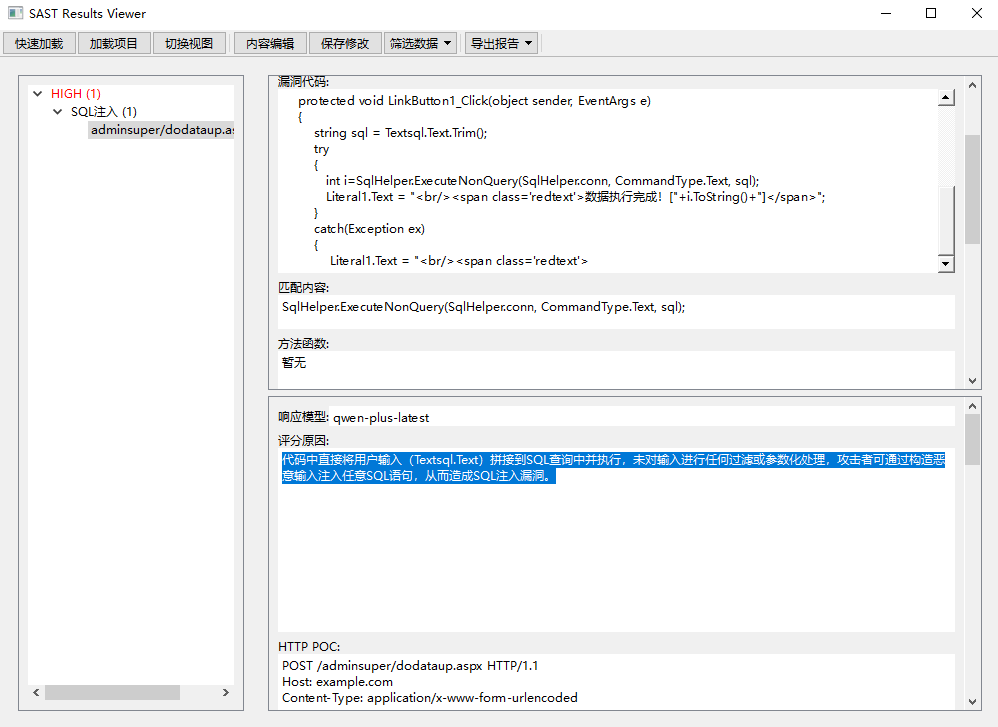

# X-SAST 专业多语言代码安全审计工具套件

## 项目背景

在渗透测试和安全评估过程中，高效快速的代码审计是一项关键能力。

现有工具如 Seay 和 Fortify SCA 各有局限性：

- Seay：仅适用于 PHP 环境，正则匹配结果冗余，缺乏有效的审计进度管理
- Fortify SCA：虽支持多语言，但扫描耗时长，且常因语法环境缺失导致分析失败

渗透测试人员通常采用关键函数追溯方法进行快速代码审计。

经过市场调研，发现缺乏一款真正实用的、面向安全从业者的多语言快速代码审计工具。

市场上主要是 semgrep、IRFIY、CodeQL 等基于 DSL 的分析工具，但这些工具分析速度相对较慢，不适合快速审计场景。

基于这一需求缺口，我们开发了 X-SAST，一款结合 Seay 和 Fortify 优势的多语言快速代码审计工具套件。

## 核心功能

1. **基于正则的通用引擎**：支持多种编程语言，实现快速代码扫描
2. **AI 辅助验证**：利用人工智能技术自动筛选和验证扫描结果，快速筛选误报结果
3. **专业审计 UI**：提供直观的界面，支持人工进一步分析和筛选 AI 验证后的结果
4. **IDE 联动**：与主流 IDE 集成，提供代码流追踪功能
5. **代码流分析**：深入分析代码结构，PHP 部分已完成实现，其他语言持续开发中

## 工具套件组成

X-SAST 工具套件包含以下核心组件：

- **X1_checker**：自动化规则检查引擎，支持命令行操作
- **X2_verifier**：AI 增强的验证引擎，集成了 X1_checker 的所有功能，并增加 AI 辅助分析能力
- **X3_auditor**：人工审计图形界面，用于深入分析和确认扫描结果
- **X9_editor**：规则编辑器，支持自定义安全规则的创建和管理

## 系统架构

X-SAST 采用模块化设计，各组件可独立使用，也可协同工作：

1. 基础扫描层（X1_checker）：基于正则规则引擎，高效识别潜在安全问题
2. AI 增强层（X2_verifier）：利用多种 AI 模型验证扫描结果，降低误报率
3. 人工审计层（X3_auditor）：提供专业的审计界面，支持深入分析和确认
4. 规则管理层（X9_editor）：支持规则的创建、编辑和管理

## 发布说明

目前 X-SAST 以二进制形式发布，核心程序开源, 其他部分提供 Windows 平台的预编译可执行程序：

其中 X3_auditor 支持直接导入 X1_checker 的审计结果, X2_verifier 存在与否不影响用户使用.

对于其他平台的打包需求, 可联系开发团队获取支持, 或自行进行编译打包。

- **X1_checker.exe**：规则检查引擎（命令行工具 开源）

- **X2_verifier.exe**：AI 验证引擎（命令行工具 提供可执行文件,使用需要License）

- **X3_auditor.exe**：人工审计工具（GUI 程序 开源）
- X3载入X1结果示例 

- X3载入X2结果示例 

- **X9_editor.exe**：规则编辑器（GUI 程序 开源）

## 目标用户

X-SAST 专为以下用户设计：

- 安全研究人员
- 渗透测试工程师
- 需要快速评估代码安全性的开发团队
- 安全教育和培训机构

## 产品优势

- **多语言**：适用于各种主流编程语言
- **高效性**：比传统 SAST 工具速度更快，适合快速安全评估
- **准确性**：AI 辅助验证和人工审计能够大幅降低误报率和漏报
- **易用性**：简洁的命令行工具和直观的图形界面，降低使用门槛
- **可扩展性**：支持自定义规则，满足特定安全需求

## 技术规格

- 开发语言：Python
- 分发方式：Pyinstaller 打包的可执行程序
- 支持平台：Windows（其他平台可定制）
- AI 模型支持：集成多种本地和云端 AI 模型

## 技术缺陷
本工具只是为了更快、更透明、更自定义的实现常规审计, 因此主要是聚焦于规则审计这一块。

如果目标是实现高精度审计, 审计时间较充裕, 建议深入研究各类语法树分析审计工具。

### 正则审计的两个主要缺点:
- 1、对于不精确的规则，在扫描较大项目时, 会导致很多非必要结果。
-  因此X2_verifier主要是通过AI初步筛选解决正则匹配结果过多问题.
- 2、基于正则的审计在处理多层漏洞时, 无法自动分析, 但语法流分析这一块已经有很多产品了。 
-   另外X1也实现了treesitter语法解析, 不过由于工作量太大, 目前只实现了PHP语法的解析.

### 正则审计的两个主要优点:
- 1、分析规则易于编写和获取
- 2、不需要对每种语言进行深度语法适配就可以快速适配各种语言类型

### 其他优化方案
- 1、实现其他语言的语法分析
- 2、使用GO|RUST进行重构,减小程序大小

## 付费支持
因本次项目开发投入较大, X2_verifier 组件将采用授权模式提供, 加入**纷传|星球**后可获取License.

加入纷传|星球的好处
1. **快速支持** 您的问题将获得更快的响应时间，确保您能够及时解决问题。
2. **定制开发** 根据您的具体需求，我们可以为您开发定制化的工具和解决方案。
3. **更多规则** 优先响应实现更高级别的审计规则集，提升更多语言的审计支持。
4. **社区论坛** 参与社区讨论，与其他成员交流经验和心得。
5. **活动优惠** 享受专属折扣和优惠，使用我们的其他产品和服务时更加划算。

## 联系方式

如需获取更多信息、技术支持或定制服务，请通过以下方式联系我们：

NOVASEC微信公众号或通过社交信息联系【酒零】

---

*X-SAST - 为安全专业人员打造的新一代快速代码审计利器*
