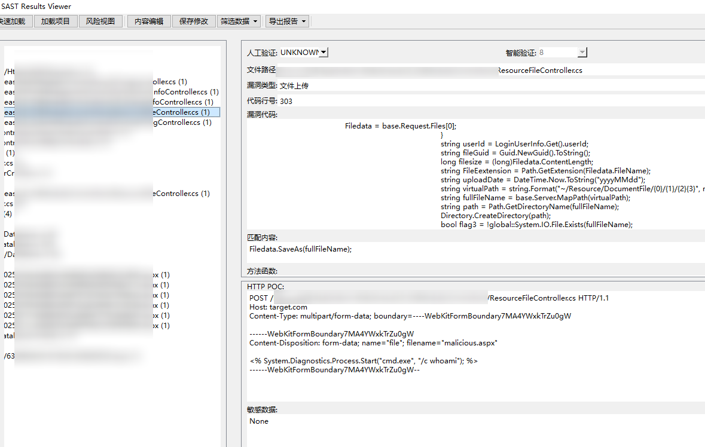

# X-SAST 专业多语言代码安全审计工具套件

---

# 产品自述

## 是否必须依赖 IDE？

在当前的实现中，代码展示部分的可视化效果并不理想。这部分内容主要是为了辅助说明代码位置，
面向最终用户的代码阅读窗口主要是通过内置和外置编辑器。

对于**数据流调用追踪**等复杂功能，确实需要与 IDE 协同工作才能达到最佳效果。目前市面上主流的开发 IDE 在代码导航、符号解析、上下文分析等方面表现非常出色，是进行深度审计时不可或缺的工具。

不过，本产品也内置了轻量级的文本编辑器模块，支持对代码进行简单的查看和AI咨询操作，适用于基础的浏览需求。

---

## 主要用途说明

本工具的核心目标是帮助(渗透测试)用户快速发现一些**易于识别的安全漏洞**，例如：

- 文件上传漏洞
- 常见SQL注入
- 命令执行漏洞
- 等等浅层次漏洞

对于深层次跳转漏洞其检测与验证过程高度依赖使用者自身的审计能力。

此时建议结合 IDE 的搜索、引用追踪等功能进行人工或半自动分析。

对于(逻辑绕过、权限控制缺陷) 我没有研究, 因此也没有编写对应审计规则.

---

## 本工具是否仍有存在的意义？

答案是肯定的。

尽管市面上已有众多专业的 SAST 工具和 AST 分析平台，但在某些特定场景下仍存在空白：

1. **通用审计要求**：很多工具专注于某一类语言或框架，难以适应多样化的项目环境。
2. **通用场景要求**：很多时候审计是没有完整代码的, 正则审计无需完整代码结构即可进行初步筛选，适合用于快速排查。
3. **响应速度要求**：在攻防演练、CTF 或应急响应等场景中，需要快速定位可疑点，而不是等待完整的扫描流程。

因此，本工具的设计初衷是填补“**轻量级、通用型、快速响应**”的代码审计工具空白。

它并非替代现有工具，而是作为补充，提升网络安全工程师在实战中的效率。

> 如果未来有开发者能在此基础上构建出更强大的版本，我也非常乐意 Fork 和参与共建。

---

## AI 模块是否必要？

AI 辅助功能在本产品属于中**辅助性质**，并非必需组件。

它的作用主要包括：

- **结果过滤**：例如原本扫描出 1000 条疑似漏洞，AI 可以过滤概率极小的结果, 提高审计效率。
- **标注建议**：AI 可尝试指出哪些条目最可能存在问题，引导审计者优先关注。
- **POC 辅助生成**：基于已知漏洞特征，AI 可尝试生成用于参考的基本POC格式, 供用户进一步分析使用。

但如果您已经明确了审计目标漏洞类型（如只关注上传漏洞）且代码数量有限 那么完全不需要 AI 模块也能高效完成任务。

> AI 提示词已开源，使用者可根据自身需求自由定制或替换模块，欢迎用户提供提示词优化。

---

## 总结

本工具的价值在于：

✅ 快速定位常见漏洞  
✅ 支持多种语言的正则匹配  
✅ 轻量级部署，适合攻防实战  
✅ 可与 IDE 高效联动  
✅ 开源开放，欢迎社区共建  

如果您正在寻找一个能在实战中快速上手、灵活配合其他工具使用的代码审计辅助系统，X-SAST 是一个值得尝试的选择。

--- 

## 一些日常审计示例

### 文件上传示例:

---

## 付费支持
因本次项目开发投入较大,X2_verifier 组件将采用授权模式提供。

单独获取X2审计模块 ￥49.99 可获取至少1年使用权, 本程序License支持离线使用.

如果需要单独获取程序,可以在下面找到我的联系方式, 用户需要求多的话, 我会尝试上架店铺..

**提示: License仅代表软件使用权, 不代表AI的API使用费**.

加入**纷传|星球**后可获取我们常见工具的授权License, 授权时长以License价格为准. 

如: 加入圈子半年 将一次性赠送license 1年有效期时间, 

如过后续圈子没有其他产出, 将会延长License时间至长期, 主打一个不白来.

加入纷传|星球的好处
1. **快速支持** 您的问题将获得更快的响应时间，确保您能够及时解决问题。
2. **定制开发** 根据您的具体需求，我们可以为您开发定制化的工具和解决方案。
3. **更多规则** 优先响应实现更多语言的审计规则集，提升更多语言的审计支持。
4. **社区论坛** 参与社区讨论，与其他成员交流工具使用问题和经验心得。
5. **活动优惠** 享受专属折扣和优惠，使用我们的其他产品和服务时更加划算。
6. **优化版本** 已开源的产品稳定使用后将使用Go|Rust等语言进行不断迭代.

---

## 联系方式
如需获取更多信息、技术支持或定制服务，请通过以下方式联系我们：

NOVASEC微信公众号留言或通过社交信息联系【酒零】

---

*X-SAST - 为安全专业人员打造的新一代快速代码审计利器*

